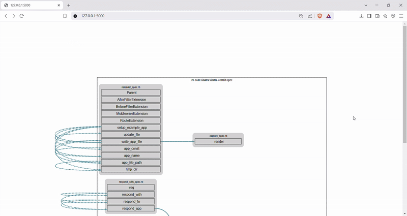

# 🔍 Ruby Call Graph Generator

A static analysis tool to **generate interactive call graphs** for Ruby projects.  
It aims to make it easier to:

- Understand source code structure
- Visualize the call flow between functions and files
- Reverse-engineer existing Ruby applications
- Explore the architecture of legacy or unfamiliar codebases



---

## 🚀 Features

- Parses Ruby code into an abstract syntax tree (AST)
- Detects function definitions and cross-references method calls
- Builds a visual call graph grouped by file/module
- Highlights relationships between methods across files
- Useful for auditing, onboarding, refactoring, or learning purposes

---

## 🛠 Installation

### Ruby Dependencies

Install the required gems:

```bash
gem install parser
gem install rgl
```

### Python Dependencies (for preview web UI)

```bash
pip install graphviz
pip install flask
```

> 📝 Make sure `dot` (Graphviz binary) is available in your system path.

---

## 📦 Usage

To generate the call graph:

```bash
ruby ./bin/generate_call_graph.rb
```

This will generate:

- A `call_graph.json` representation of AST structure in define format.

To preview the graph in a browser:

```bash
python handler.py
```
This will generate:

- A `output.json` representation of the call graph
- A `.dot` file for Graphviz
- Optional: a web UI to interact with the graph visually
Open `http://localhost:5000` to explore your call graph!

---

## 🧠 Why Use This?

- 📖 Make sense of legacy projects
- 🚀 Speed up onboarding for new developers
- 🧹 Plan better refactors
- 🛠 Reverse engineer behavior and code ownership

---
